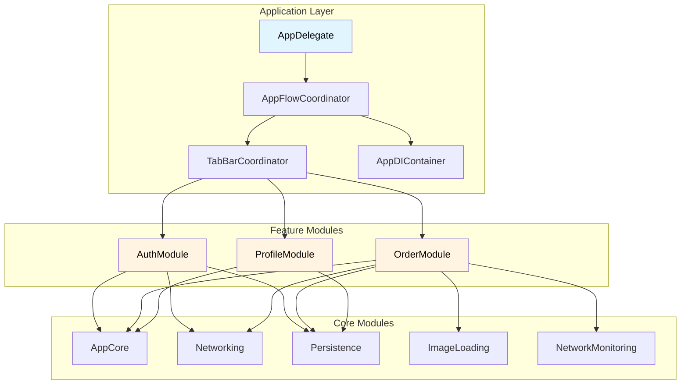

# BrewCrew App ☕

A modern iOS application built with Swift, showcasing enterprise-level architecture patterns. This app demonstrates a complete coffee ordering system with authentication, menu browsing, order management, and user profile features.

https://github.com/user-attachments/assets/16b4c418-1816-4577-89c1-5462c7be4386

## 📱 Overview

The BrewCrew App allows users to authenticate, browse a coffee menu, customize orders with modifiers, track order history, and manage their profile. Built with **iOS 17+** using Swift Concurrency, SwiftUI, and modular architecture.

## 🏗️ Architecture

### Technology Stack

- **UI**: SwiftUI
- **Architecture**: MVVM + Clean Architecture
- **Navigation**: Coordinator Pattern
- **DI**: Resolver (app-level) + Constructor Injection (module-level)
- **Concurrency**: Swift Concurrency (async/await, actors)
- **Persistence**: Core Data
- **Networking**: Custom async/await networking layer

### Architecture Setup

**Dependency Injection**: Hybrid approach using Resolver at app level for dependency registration, and constructor injection within modules to maintain independence and testability.

**Coordinator Pattern**: Uses `UINavigationController` navigation stacks for fine-grained control, supporting both SwiftUI views (via `UIHostingController`) and UIKit view controllers. Hierarchical structure: AppFlowCoordinator → TabBarCoordinator → Feature Coordinators.

**MVVM + Clean Architecture**: Each feature module follows Clean Architecture with three layers:
- **Presentation**: SwiftUI Views + ViewModels (ObservableObject)
- **Domain**: Use Cases encapsulating business logic
- **Data**: Repository pattern with remote API and local data store

**Swift Concurrency**: Use of `async/await`, `@MainActor` for structured concurrency.

## 📦 Module Structure

### Core Modules
- **AppCore**: Shared domain models
- **Networking**: Generic networking layer
- **Persistence**: Core Data abstraction
- **NetworkMonitoring**: Connectivity monitoring
- **ImageLoading**: Image service abstraction
- **DesignSystem**: Shared UI components
- **AppModels**: Shared data models
- **AppUtils**: Utility extensions

### Feature Modules
- **AuthModule**: Authentication (login, logout, session management)
- **CoffeeModule**: Menu browsing, order creation, order history
- **ProfileModule**: User profile management

### Architecture Diagram

## 🎯 Architectural Decisions

### 1. Coordinator Pattern with Navigation Stacks

**Why**: Provides finer control over navigation, enables seamless SwiftUI/UIKit integration, centralizes navigation logic, and supports complex flows (deep linking, conditional navigation).

**How**: Coordinators wrap SwiftUI views in `UIHostingController` and push them onto navigation stacks, maintaining UIKit capabilities while leveraging SwiftUI.

### 2. Modular Architecture

**Why**: 
- **Team Scalability**: Clear boundaries enable parallel development
- **Build Time**: Independent modules build in parallel, reducing incremental build times
- **Dependency Management**: Explicit dependencies improve maintainability
- **Testability**: Modules can be tested in isolation

### 3. Dependency Injection Strategy

**Why**: Resolver at app level simplifies startup; constructor injection in modules maintains independence, improves testability, and makes dependencies explicit.

### 4. Clean Architecture

**Why**: 
- **Team Collaboration**: Clear layer boundaries for parallel work
- **Maintainability**: Business logic isolated in Domain layer
- **Testability**: Each layer tested independently
- **Flexibility**: Data sources can be swapped without affecting business logic

## 🧪 Testing

Comprehensive unit testing across all layers:

- **ViewModels**: State management, data loading, error handling (`DefaultOrderListViewModelTests`, `DefaultMenuListViewModelTests`)
- **Use Cases**: Business logic with success/failure scenarios (`GetOrdersUseCaseTests`, `CreateOrderUsecaseTests`)
- **Repository Layer**: Data transformation and persistence logic
- **View Tests**: SwiftUI view testing using `ViewInspector`

**Approach**: Protocol-based mocking, async/await testing, isolated test cases covering happy paths and error scenarios.

## 🚀 Getting Started

### Requirements
- Xcode 15.0+
- iOS 17.0+
- Swift 5.9+

### Setup
1. Clone the repository
2. Open `Coffee App.xcodeproj` in Xcode
3. Build and run

## 📝 Key Features

- ✅ Modular architecture with SPM
- ✅ Clean Architecture with clear layer separation
- ✅ Coordinator-based navigation
- ✅ Comprehensive unit test coverage
- ✅ Swift Concurrency throughout
- ✅ Offline-first with Core Data
- ✅ Network monitoring and retry mechanisms
- ✅ Protocol-oriented design

---

**Built with ❤️ using Swift and Clean Architecture principles**
