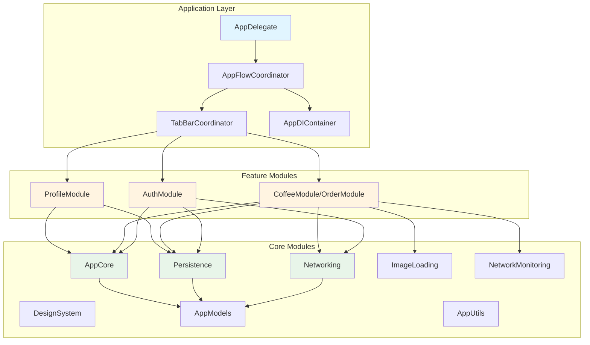
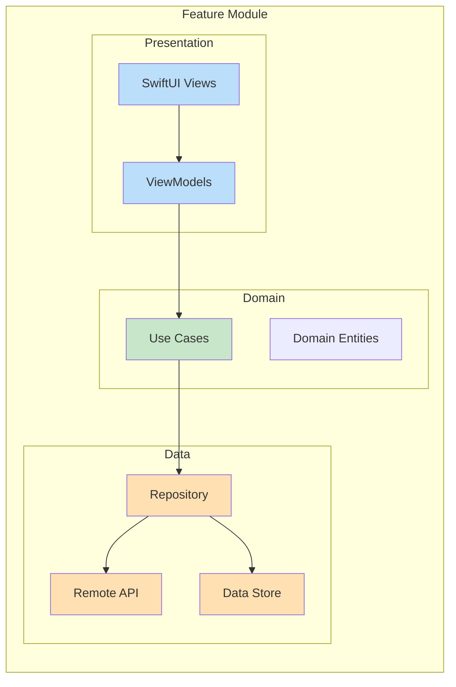

Exploring the codebase to understand the architecture and structure.


[14 tools called]


Drafting the README. Checking a few more details:


[2 tools called]


README for the Coffee App project:

```markdown
# Coffee App ☕

A modern iOS application built with Swift, showcasing enterprise-level architecture patterns and best practices. This app demonstrates a complete coffee ordering system with authentication, menu browsing, order management, and user profile features.

## 📱 Overview

The Coffee App is a full-featured iOS application that allows users to:
- **Authenticate** securely with username and password
- **Browse** a comprehensive coffee menu with detailed item information
- **Customize** orders with modifiers and options
- **Track** order history and status
- **Manage** user profile and settings

Built with **iOS 17+** and leveraging modern Swift features including Swift Concurrency, SwiftUI, and modular architecture.

## 🏗️ Architecture

### Technology Stack

- **UI Framework**: SwiftUI with UIKit integration
- **Architecture Pattern**: MVVM + Clean Architecture
- **Navigation**: Coordinator Pattern with UINavigationController
- **Dependency Injection**: Resolver (app-level) + Constructor Injection (module-level)
- **Concurrency**: Swift Concurrency (async/await, actors)
- **Persistence**: Core Data
- **Networking**: Custom networking layer with async/await
- **Image Loading**: SDWebImage integration
- **Network Monitoring**: Real-time connectivity status tracking

### Architecture Setup

#### Dependency Injection
The app uses a hybrid DI approach:
- **App Level**: Resolver framework for dependency registration and resolution
- **Module Level**: Constructor injection to maintain module independence and testability
- **Dependency Containers**: Feature-specific containers (AuthDIContainer, OrderListDIContainer, etc.) manage module dependencies

#### Coordinator Pattern for Navigation
The Coordinator pattern provides fine-grained control over navigation:
- Uses `UINavigationController` navigation stacks for precise control
- Supports both SwiftUI views (via `UIHostingController`) and UIKit view controllers
- Each feature module has its own coordinator (AuthCoordinator, MenuListCoordinator, OrderListCoordinator, ProfileCoordinator)
- Hierarchical coordinator structure: AppFlowCoordinator → TabBarCoordinator → Feature Coordinators

#### MVVM + Clean Architecture
Each feature module follows Clean Architecture principles with clear separation of concerns:

```
Presentation Layer (MVVM)
    ↓
Domain Layer (Use Cases, Business Logic)
    ↓
Data Layer (Repository, API, Data Store)
```

- **Presentation**: SwiftUI Views + ViewModels (ObservableObject)
- **Domain**: Use Cases encapsulating business logic
- **Data**: Repository pattern with remote API and local data store implementations

#### Swift Concurrency
- Extensive use of `async/await` for asynchronous operations
- `@MainActor` for UI-related code to ensure thread safety
- Structured concurrency with `Task` for background work
- Actor-based isolation where appropriate

## 📦 Module Structure

The project is organized into **Core** and **Feature** modules, following a modular monolith approach:

### Core Modules

- **AppCore**: Shared domain models and core business entities
- **AppConstants**: Application configuration and constants
- **AppEndpoints**: API endpoint definitions
- **AppModels**: Shared data models (User, Order, Menu)
- **AppUtils**: Utility extensions and helpers
- **Networking**: Generic networking layer with protocol-based design
- **Persistence**: Core Data abstraction layer with repository pattern
- **NetworkMonitoring**: Real-time network connectivity monitoring
- **ImageLoading**: Image loading service abstraction
- **DesignSystem**: Shared UI components, colors, fonts, and design tokens

### Feature Modules

- **AuthModule**: Authentication flow (login, logout, session management)
- **CoffeeModule** (OrderModule): Menu browsing, order creation, order history
- **ProfileModule**: User profile management and settings

### High-Level Architecture Diagram



### Module Internal Structure (Clean Architecture)



## 🎯 Architectural Decisions

### 1. Coordinator Pattern with Navigation Stacks

**Decision**: Use Coordinator pattern with `UINavigationController` navigation stacks instead of SwiftUI's `NavigationStack`.

**Rationale**:
- Provides **finer control** over navigation flow and transitions
- Enables seamless integration of **both SwiftUI views** (via `UIHostingController`) and **UIKit view controllers**
- Centralizes navigation logic, making it easier to test and maintain
- Supports complex navigation scenarios (deep linking, conditional flows) more effectively
- Allows for better separation between navigation concerns and view logic

**Implementation**: Each coordinator wraps SwiftUI views in `UIHostingController` and pushes them onto the navigation stack, maintaining UIKit's navigation capabilities while leveraging SwiftUI's declarative UI.

### 2. Modular Architecture

**Decision**: Organize codebase into separate Swift Package Manager modules (Core and Feature modules).

**Rationale**:
- **Team Scalability**: Clear module boundaries enable multiple developers to work on different features simultaneously without conflicts
- **Build Time Optimization**: Independent modules can be built in parallel, significantly reducing incremental build times as the app grows
- **Dependency Management**: Explicit dependencies between modules make the architecture more maintainable and easier to understand
- **Testability**: Modules can be tested in isolation, improving test reliability and speed
- **Reusability**: Core modules can be shared across multiple projects or features

**Structure**:
- **Core Modules**: Shared infrastructure and utilities (Networking, Persistence, DesignSystem)
- **Feature Modules**: Self-contained features with their own Data/Domain/Presentation layers

### 3. Dependency Injection Strategy

**Decision**: Use Resolver at the app level, constructor injection within modules.

**Rationale**:
- **App Level (Resolver)**: Centralized dependency registration simplifies app startup and configuration
- **Module Level (Constructor Injection)**: 
  - Modules remain **independent** of Resolver framework
  - Improves **testability** - dependencies can be easily mocked
  - Reduces coupling - modules don't depend on external DI frameworks
  - Makes dependencies **explicit** and easier to understand

**Implementation**: Dependencies are registered in `AssemblyRegistration` using Resolver, but modules receive dependencies through constructors, maintaining clean boundaries.

### 4. Clean Architecture Across Feature Modules

**Decision**: Implement Clean Architecture with Data/Domain/Presentation layers in each feature module.

**Rationale**:
- **Team Collaboration**: Clear layer boundaries allow team members to work on different layers without stepping on each other
- **Maintainability**: Business logic is isolated in the Domain layer, making it easier to modify and test
- **Testability**: Each layer can be tested independently with appropriate mocks
- **Scalability**: As the team grows, developers can specialize in specific layers (UI, business logic, data)
- **Flexibility**: Data sources (API, local storage) can be swapped without affecting business logic

**Benefits**:
- Domain layer is framework-agnostic (no UIKit/SwiftUI dependencies)
- Use Cases encapsulate business rules and can be easily unit tested
- Repository pattern abstracts data sources, enabling offline-first capabilities

## 🧪 Testing

The project includes comprehensive unit testing across all architectural layers:

### Test Coverage

#### ViewModels
- **Location**: `Modules/Feature/*/Tests/*/ViewModelTests/`
- **Examples**: 
  - `DefaultOrderListViewModelTests`: Tests order list state management, data loading, error handling
  - `DefaultMenuListViewModelTests`: Tests menu loading, order creation flow, network status handling
  - `DefaultMenuModifierBottomSheetViewModelTests`: Tests modifier selection logic and price computation

#### Use Cases
- **Location**: `Modules/Feature/*/Tests/*/UseCaseTests/`
- **Examples**:
  - `GetOrdersUseCaseTests`: Tests order retrieval logic with success/failure scenarios
  - `GetMenuUsecaseTests`: Tests menu data fetching
  - `CreateOrderUsecaseTests`: Tests order creation with network monitoring
  - `RetryPendingOrdersUsecaseTests`: Tests offline order retry mechanism

#### Repository Layer
- **Location**: `Modules/Feature/*/Tests/*/RepositoryTests/`
- Tests repository implementations with mocked data stores and remote APIs
- Validates data transformation between API models and domain entities

#### View Tests
- **Location**: `Modules/Feature/*/Tests/*/ViewTests/`
- Uses `ViewInspector` framework for SwiftUI view testing
- Tests view rendering based on ViewModel state

### Testing Approach

- **Mocking**: Protocol-based mocking for dependencies (Use Cases, Repositories, Network Services)
- **Test Doubles**: Fake implementations for repositories and APIs (`FakeOrderModuleRepository`, `FakeOrderModuleRemoteAPI`)
- **Async Testing**: Leverages Swift Concurrency testing capabilities with `async/await`
- **Isolation**: Each test is independent with proper setup/teardown
- **Coverage**: Tests cover happy paths, error scenarios, and edge cases

### Test Structure Example

```swift
@MainActor
final class DefaultOrderListViewModelTests: XCTestCase {
    func testDefaultOrderListViewModel_WhenGetOrdersSucceeds_DatasourceCountIsCorrect() async {
        // Given
        let mockUseCase = MockGetOrdersUseCase(result: .success([Order.createFake()]))
        sut = DefaultOrderListViewModel(getOrdersUseCase: mockUseCase, navigationDelegate: nil)
        
        // When
        await sut.viewDidLoad()
        
        // Then
        XCTAssertEqual(sut.datasource.count, 1)
        XCTAssertEqual(sut.state, .dataFetched)
    }
}
```

## 🚀 Getting Started

### Requirements

- Xcode 15.0+
- iOS 17.0+
- Swift 5.9+

### Setup

1. Clone the repository
2. Open `Coffee App.xcodeproj` in Xcode
3. Configure API credentials in `Coffee-App-Info.plist`:
   - `apiKey`: Your API key
   - `apiBaseURL`: Base URL for the API
4. Build and run the project

### Project Structure

```
Coffee App/
├── Coffee App/                    # Main app target
│   ├── Application/               # App setup, coordinators, DI
│   └── Assets.xcassets/           # App assets
├── Modules/
│   ├── Core/                      # Core modules
│   │   ├── AppCore/
│   │   ├── Networking/
│   │   ├── Persistence/
│   │   ├── DesignSystem/
│   │   └── ...
│   └── Feature/                   # Feature modules
│       ├── AuthModule/
│       ├── CoffeeModule/
│       └── ProfileModule/
└── CoffeeAppTests/                # App-level tests
```

## 📝 Key Features

- ✅ Modular architecture with Swift Package Manager
- ✅ Clean Architecture with clear layer separation
- ✅ Coordinator-based navigation
- ✅ Comprehensive unit test coverage
- ✅ Swift Concurrency throughout
- ✅ Offline-first with Core Data persistence
- ✅ Network monitoring and retry mechanisms
- ✅ Protocol-oriented design
- ✅ Dependency injection with clear boundaries

## 🛠️ Technologies & Frameworks

- **SwiftUI** - Modern declarative UI framework
- **UIKit** - Navigation and coordinator integration
- **Core Data** - Local persistence
- **Resolver** - Dependency injection
- **SDWebImage** - Image loading and caching
- **ViewInspector** - SwiftUI view testing

## 📄 License

This project is a portfolio piece demonstrating iOS development best practices and architectural patterns.

---

**Built with ❤️ using Swift and Clean Architecture principles**
```
